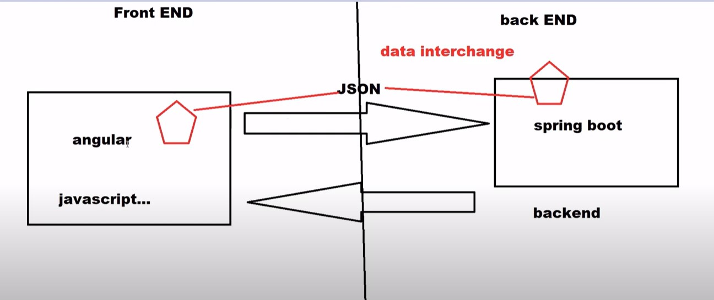

#### Create email service web service

- we already created Java Mail service here: https://github.com/sample-projects-only/java_email
- Now we will convert this to Springboot web Service and test using postman. 
- for this we are creating one Spring Boot application and create service. 
- Later we will create angular service for frontend



- JSON is used for data transfer in case of web services same as xml was used before for SOAP

### Steps:

- Created empty Spring Boot application and imported in IntelliJidea
- Created controller com/email/controller/EmailApiApiService.java 

```java
package com.email.controller;

import org.springframework.stereotype.Controller;
import org.springframework.web.bind.annotation.RequestMapping;
import org.springframework.web.bind.annotation.ResponseBody;
import org.springframework.web.bind.annotation.RestController;

@RestController
public class EmailApiApiService {

    @RequestMapping (value = "/welcome")
    @ResponseBody
    public String sayHello(){
        return "Hello World Modified";
    }
}

```

- and tested it here: http://localhost:8080/welcome

```text
curl --location --request GET 'http://localhost:8080/welcome'

Hello World Modified
```
- next we will create Service here: com/email/service/EmailService.java - added method from https://raw.githubusercontent.com/sample-projects-only/java_email/master/src/main/java/org/nitin/App.java

- also created enitiy class here: com/email/entity/Email.java

- Now we will call EmailService in controller and pass data to it.

- ensure to enter password for sender email in service. 

- Run the Application and do POST call to Service, make sure data object is having correct mapping of variable from Email class. 

```text
curl --location --request POST 'http://localhost:8080/sendemail' \
--header 'Content-Type: application/json' \
--data-raw '{
    "subject" : "test subject only",
     "message": "test message",
     "recipent_add" : "official.nitinjain@gmail.com",
     "sender_add" : "nitin.ibm2006@gmail.com"
}'
```

-  This will send email to sender

- added boolean variable to service so that we can catch response if email is not sent successfully and display error. 

